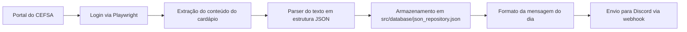

# CEFSA Menu ETL

[](https://www.python.org/)
[](https://playwright.dev/)
[](https://discord.com/developers/docs/resources/webhook)

ETL em Python para automatizar a coleta, normalização e divulgação do cardápio semanal do CEFSA por meio de um webhook do Discord.

---

## Sobre o projeto

Este projeto nasceu para resolver uma necessidade simples, porém recorrente: automatizar a extração do cardápio do aluno do CEFSA e compartilhá-lo em um canal do Discord sem que o usuário precise acessar a plataforma manualmente todos os dias.

A solução implementada combina:

- automação de login em um portal externo;
- extração do conteúdo do cardápio em HTML/texto;
- parsing e organização dos dados em estrutura JSON;
- envio da mensagem formatada para Discord;
- execução periódica por meio de GitHub Actions.

Em alto nível, o projeto funciona como um pipeline ETL: coleta dados de uma fonte web, transforma o texto bruto em um formato estruturado e publica o resultado em um canal de comunicação.

---

## Funcionalidades

- Extração do cardápio semanal da página autenticada do CEFSA;
- Parsing do texto para separar dias, refeições e itens do menu;
- Persistência do conteúdo em JSON para versionamento e reuso;
- Formatação da mensagem final para envio ao Discord;
- Publicação automática do cardápio do dia em um webhook;
- Atualização periódica via GitHub Actions;
- Armazenamento do estado do cardápio em um arquivo JSON no repositório.

---

## Tecnologias e ferramentas

### Linguagens

- Python 3.13 (utilizado no workflow de CI/CD)

### Bibliotecas e frameworks

- Playwright
- python-dotenv
- requests

### Infraestrutura e automação

- GitHub Actions
- Git
- GitHub

### Integrações

- Portal do aluno do CEFSA
- Discord Webhook

### Dependências principais

O arquivo [requirements.txt](requirements.txt) contém as bibliotecas utilizadas no projeto, incluindo:

- `playwright==1.62.0`
- `python-dotenv==1.2.3`
- `requests==2.34.2`

---

## Arquitetura e funcionamento

O fluxo do sistema é simples e segue a lógica de ETL.



### Fluxo real do projeto

1. O módulo de cliente acessa a página do CEFSA e realiza o login com usuário e senha.
2. O conteúdo da página é lido e filtrado para localizar a seção "Cardápio Semanal".
3. O parser identifica os dias da semana, refeições e itens alimentares.
4. Os dados são salvos em um arquivo JSON no diretório `src/database`.
5. O job de envio lê esse JSON, identifica o dia atual e formata a mensagem.
6. O webhook do Discord recebe a mensagem em markdown simples.

---

## Estrutura do projeto

```text
cefsa_menu_etl/
├── .github/
│   └── workflows/
│       ├── send_menu.yml
│       └── update_menu.yml
├── src/
│   ├── cefsa/
│   │   ├── __init__.py
│   │   └── client.py
│   ├── database/
│   │   ├── __init__.py
│   │   ├── json_repository.json
│   │   └── save_json.py
│   ├── discord/
│   │   └── discord.py
│   ├── jobs/
│   │   ├── send_menu.py
│   │   └── update_menu.py
│   ├── transform/
│   │   ├── __init__.py
│   │   ├── formatter.py
│   │   └── parser.py
│   └── __init__.py
├── .env.example
├── .gitignore
├── requirements.txt
├── README.md
└── venv/
```

### Responsabilidade dos principais diretórios

- `src/cefsa/`: lógica de autenticação e extração de dados do portal do CEFSA.
- `src/transform/`: limpeza, parsing e formatação dos dados extraídos.
- `src/database/`: persistência do cardápio em JSON.
- `src/discord/`: envio de mensagens para o Discord via webhook.
- `src/jobs/`: pontos de entrada para atualização e envio do menu.
- `.github/workflows/`: automação do fluxo em GitHub Actions.

---

## Requisitos

Para executar o projeto localmente, são necessários:

- Python 3.13+ (o workflow usa 3.13, mas o projeto também pode ser executado com uma versão compatível)
- Acesso ao portal do CEFSA com login e senha válidos
- Dependências Python do arquivo [requirements.txt](requirements.txt)
- Navegador Chromium para o Playwright
- Webhook do Discord configurado
- Arquivo `.env` com as variáveis necessárias

> O projeto usa o Playwright para abrir e navegar em um navegador em modo automatizado. Por isso, no ambiente local é necessário instalar o Chromium do Playwright antes da primeira execução do job de atualização.

---

## Configuração

Crie um arquivo `.env` na raiz do projeto baseado no modelo de [`.env.example`](.env.example):

```env
CEFSA_USUARIO=seu_usuario
CEFSA_SENHA=sua_senha
DISCORD_WEBHOOK_URL=seu_webhook_do_discord
```

### Variáveis de ambiente

- `CEFSA_USUARIO`: usuário do portal do CEFSA.
- `CEFSA_SENHA`: senha do portal do CEFSA.
- `DISCORD_WEBHOOK_URL`: URL do webhook do Discord para publicação do cardápio.

> Os valores reais devem ser preenchidos localmente e nunca enviados para o repositório.

---

## Como executar localmente

### 1) Clone o projeto

```bash
git clone <url-do-repositorio>
cd cefsa_menu_etl
```

### 2) Crie e ative um ambiente virtual

#### Windows

```powershell
python -m venv .venv
.\.venv\Scripts\activate
```

#### Linux/macOS

```bash
python -m venv .venv
source .venv/bin/activate
```

### 3) Instale as dependências

```bash
pip install -r requirements.txt
```

### 4) Instale o navegador Chromium do Playwright

```bash
playwright install --with-deps chromium
```

### 5) Configure as variáveis de ambiente

```bash
copy .env.example .env
```

Edite o arquivo `.env` com os dados reais do CEFSA e do Discord.

### 6) Atualize o cardápio

```bash
python -m src.jobs.update_menu
```

Esse comando acessa o portal, extrai o menu e salva o resultado em [src/database/json_repository.json](src/database/json_repository.json).

### 7) Envie o cardápio para o Discord

```bash
python -m src.jobs.send_menu
```

Esse comando lê o JSON do dia atual e publica a mensagem formatada no webhook configurado.

---

## Uso

A execução do projeto é orientada por dois jobs principais:

### Atualização do cardápio

```bash
python -m src.jobs.update_menu
```

Esse processo:

- autentica no portal do CEFSA;
- busca o conteúdo do menu;
- trata o texto;
- salva os dados em um JSON como estrutura de dias e refeições.

### Envio do dia atual para o Discord

```bash
python -m src.jobs.send_menu
```

Esse processo:

- carrega o JSON persistido;
- identifica o dia atual;
- formata a mensagem para o Discord;
- envia a mensagem via webhook.

A mensagem final é organizada por refeição, por exemplo:

- Café da manhã
- Almoço / Jantar
- Lanche
- Lanche reforçado

---

## Demonstração

> 📸 Espaço reservado para capturas de tela do cardápio publicado no Discord ou da execução do pipeline.


Se desejar, esse espaço pode ser preenchido futuramente com:

- imagem do cardápio publicado;
- print do workflow no GitHub Actions;
- exemplo do JSON gerado;
- tela do canal do Discord.

---

## Testes

Não há suíte de testes automatizados identificada neste repositório até o momento. O projeto depende principalmente de execução manual e de automações em GitHub Actions para validar o fluxo de ETL.

---

## GitHub Actions

Há dois workflows configurados em [.github/workflows](.github/workflows):

### `update_menu.yml`

- executa em cron semanalmente;
- instala Python e dependências;
- instala o Chromium do Playwright;
- executa `python -m src.jobs.update_menu`;
- faz commit do JSON atualizado no repositório.

### `send_menu.yml`

- executa em cron de segunda a sexta;
- instala as dependências;
- executa `python -m src.jobs.send_menu`;
- publica o cardápio do dia no Discord.

Esses workflows precisam de secrets configurados no repositório:

- `CEFSA_USUARIO`
- `CEFSA_SENHA`
- `DISCORD_WEBHOOK_URL`

---

## Melhorias futuras

- [ ] adicionar testes automatizados para parser e serialização;
- [ ] documentar o formato do JSON gerado;
- [ ] incluir logs mais estruturados para diagnósticos de execução;
- [ ] adicionar suporte a outros canais de notificação além do Discord;
- [ ] criar documentação visual para o fluxo de ETL e a estrutura de dados.

---

## Licença

Nenhuma licença foi declarada no repositório. Portanto, o projeto não possui uma licença explícita documentada no momento.

---

## Autor

**Gabriel Lima de Sousa**

---

## Observações importantes

- O projeto depende de credenciais válidas do portal CEFSA e de um webhook do Discord.
- O conteúdo do menu é obtido de uma fonte externa e pode sofrer alterações sem aviso.
- O arquivo JSON gerado é versionado no repositório para ser usado por automações e consultas futuras.
- O uso de Playwright exige uma instalação correta do navegador Chromium na máquina ou ambiente de execução.

